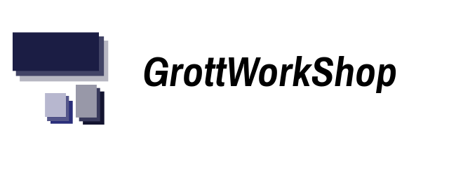

GWSSampleApps
=============

Sample Apps

# Senior Android Developer Note

Over 80% of the Android Sample Apps and Back-ported UI libraries out there are
somewhat non-production ready in their lack of rigour in android framework
knowledge, support library internals, Google Material Design, etc.

Since that is not the way Senior Android Developer do things I am going to
list the modifications and the best practices reasons for the modifications
and hopefully explain it like you were 5-year old(ELIA5):

<b>GWSMyList Modifications</b>

Just a task app and the original is called Materialist. As with most average
android demo applications and back-ported UI libraries there are glaring
mistakes in android support library knowledge and android framework knowledge
as applied to this demo application. The modifications and their best practices
justifications are:

1. Everyone remembers reveal or ripple but than either forgets about elevation or
   theme manager changes in api 21. While we do not need the additional theme
   features api 12 introduced we do need elevation back-ported. I cleaned up the
   ZdepthLayout back-port and wrapped the toolbar res xml declaration in the layout
   files with a Zdepthlayout to enable elvation for api 16 all the way to api 24.
2. Its bad form to implement a separate Splash Activity and thus that feature was removed.
   If we had some initialization delay that was noticeable to the user than one would
   implement a logo display via xml that would briefly display while application initialization
   was taking place which is not needed in this case.
3. Complexion Reduction is the current visual design trend making the in-roads in both
   android and iOS applications. Basically, its the Google Material Design and we avoid
   using images as headers for listview, gridview, and recyclerview and instead of
   using other color matching schemes for branding we stick with monochromatic
   color matching. I adjusted brand coloring using my internally prepared full
   Material Design Color Palette that happens to have everything adjusted for the
   monochromatic trend.
4. Left and Right text handling changed from api 16 to api 17. To handle that api 16
   requires different tags Left/Right and api 17 requires Start/End one puts both
   tag declarations in the res xml layout files that way its enabled for
   both api 16 and api 17.
5. Debug and Log Wrapping is somewhat an over-looked subject among the average
   android developer. One should always strive to limit and control where
   logging messages leak to in both production applications and applications
   under development to prevent leaking of data. One, I use jake Wharton's
   Timber Log Wrapper to wrap logging in all my UI back-ported libraries as
   than with me initializing Timber in the extended application class I can
   get my debug logging from my libraries during the debugging of the application.
   Two, I further extend the application class to enable leakcanary
   activity/fragment memory leakage tracking to debug application memory leaks.
6. OOP-wise the application architecture used in this application is the
   hybrid Model-View-SupervisorController-Child-ViewController with MainActivity
   as the SupervisorController.  If it was a bigger application one would
   move the view logic to either a MVP set-up with the view logic somehow
   integrated with the Presenter or one could go the full View-Model-State
   approach and use a View-Adapter to hold the view logic and have the full
   flexibility to use a full MVP or MVMM approach.
7. Support Library internals machinery enables the custom UI components that
   we create to be adjusted via the new theme manager features in api 21.
   If it was a bigger application and needed I would enable that via taking
   all the custom UI components in the mymateriallibrary and extend those
   classes with the appropriate AppCompat ones or create new AppCompat
   compatible ones to use. That is the theory behind creation of my
   GWSMaterialUIKit library which does integrate with that
   Support Library machinery.
8. Separation of Applications Crash, Logging, StrictMode, and  ANRs concerns.
   To be able to have a situation where malformed server data causes an app crash 
   and the resulting stack trace results in server ops tracking down the error and fixing
   it requires separating out rest of the crash, logging, strictmode, and anr concerns.
   I use certain libs/tool integrations that I allows me to separate these concerns out 
   so that for example I can get certain slack bot actions for a malformed server data 
   app crash as opposed to a different slack bot action for strictmode or ANR actions.
9. ANR watching using a much fuller approach than the Google Play Store one.
   The benefits is that my ANR watching is enabled during app development 
   during debug builds and thus get the ANR notifications sooner in the 
   development cycle.

# Developed By

Created by [Fred Grott](http://shareme.github.com).

# Credits

The following libraries were cleaned up to production standards and used:

[FloatingActionButton developed by Oleksandr Melnykov]()

[Material-Dialogs developed by Aidan Michael Follestad](https://github.com/afollestad/material-dialogs)

[Material Ripple developed by Balys Valentukevicius](https://github.com/balysv/material-ripple)

[Undobar developed by Liao Kai from Roman Nurik's Concept](https://github.com/soarcn/UndoBar)

[AnrWatchDog developed by Salomon BRYS](https://github.com/SalomonBrys/ANR-WatchDog)

[Strictmode Notifier developed by nshmura](https://github.com/nshmura/strictmode-notifier)

# Resources

Resources can be found at the [GWSTheWayOfAndroid wiki](http://github.com/shareme/GWSTheWayOfAndroid/wiki).

# License

Copyright (C) 2016 Fred Grott(aka shareme GrottWorkShop)

Licensed under the Apache License, Version 2.0 (the "License"); you
may not use this file except in compliance with the License. You may
obtain a copy of the License at

http://www.apache.org/licenses/LICENSE-2.0

Unless required by applicable law or agreed to in writing, software
distributed under the License is distributed on an
"AS IS" BASIS, WITHOUT WARRANTIES OR CONDITIONS OF ANY KIND,
either express or implied. See the License for the specific language
governing permissions and limitations under License.
